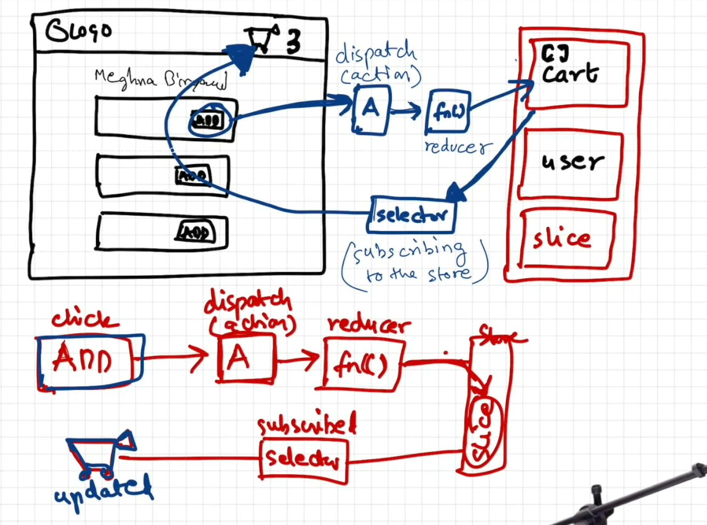

# Namaste React 🚀


# Parcel
- Dev Build
- Local Server
- HMR = Hot Module Replacement
- File Watching Algorithm - written in C++
- Caching - Faster Builds
- Image Optimization
- Minification
- Bundling
- Compress
- Consistent Hashing
- Code Splitting
- Differential Bundling - support older browsers
- Diagnostic
- Error Handling
- HTTPs
- Tree Shaking - remove unused code
- Different dev and prod bundles


# Namaste Food


/**
 * Header
 *  - Logo
 *  - Nav Items
 * Body
 *  - Search
 *  - RestaurantContainer
 *    - RestaurantCard
 *      - Img
 *      - Name of Res, Star Rating, cuisine, delery tie
 * Footer
 *  - Copyright
 *  - Links
 *  - Address
 *  - Contact
 */


# Two types of Export/Import

- Default Export/Import

export default Component;
import Component from "path";

- Named Export/Import

export const Component;
import {Component} from "path";


# React Hooks
 (Normal JS utility functions)
 ## 1.  `useState()` - Superpowerful State Variables in react
 
    ```jsx
      const [count, setCount] = useState(0);
    ```
---
    
## 2. `useEffect()` - it will be call post the respective component is rendered
  - Uses 2 argument, 
    - 1.  Callback function 
    - 2. Dependency array -> 
        - If no dependency array provided --> use Effect will be called on post every render of useEffect
  ```jsx
        useEffect(() => {
                    console.log('Component mounted');
                  }, []);
  ```
---

## 3. `useContext`

  ### **Explanation**:
  `useContext` is used to access values from a context without the need to pass props manually through every level of the component tree (prop drilling). It helps in sharing state or functionality across components, such as a theme or user authentication status.

  ### **When to Use**:
  - When you need to share values or functions across many components at different nesting levels.
  - It’s useful when you have global values that need to be accessed across the app (like themes, authentication status, or language preferences).
  ```jsx
    import React, { createContext, useContext, useState } from 'react';

  // Create a context for theme
  const ThemeContext = createContext();

  function ThemeProvider({ children }) {
    const [theme, setTheme] = useState('light');

    const toggleTheme = () => {
      setTheme((prevTheme) => (prevTheme === 'light' ? 'dark' : 'light'));
    };

    return (
      <ThemeContext.Provider value={{ theme, toggleTheme }}>
        {children}
      </ThemeContext.Provider>
    );
  }

  function ThemedComponent() {
    const { theme, toggleTheme } = useContext(ThemeContext);

    return (
      <div style={{ backgroundColor: theme === 'light' ? '#fff' : '#333', color: theme === 'light' ? '#000' : '#fff' }}>
        <p>The current theme is {theme}</p>
        <button onClick={toggleTheme}>Toggle Theme</button>
      </div>
    );
  }

  function App() {
    return (
      <ThemeProvider>
        <ThemedComponent />
      </ThemeProvider>
    );
  }

  export default App;

  ```
  ### Code Explanation:
  - ThemeContext is created to hold the theme value and toggle function.
  - The ThemeProvider component provides the theme and toggleTheme values to its children.
  - In the ThemedComponent, useContext is used to consume the context values.

---

## 4. `useReducer`

  ### **Explanation**:
  `useReducer` is a hook that helps manage complex state logic. It's similar to `useState` but is better suited for handling state transitions that depend on previous state values or involve multiple sub-values. It works with a reducer function that decides how the state should change based on different actions.

  ### **When to Use**:
  - When state logic is complex and depends on multiple actions.
  - When state updates depend on the previous state, or the state structure is more complicated (such as an object or an array).
  - In scenarios where `useState` would be hard to manage.
  
  ```jsx
    import React, { useReducer } from 'react';

  // Initial state
  const initialState = { count: 0 };

  // Reducer function
  function reducer(state, action) {
    switch (action.type) {
      case 'increment':
        return { count: state.count + 1 };
      case 'decrement':
        return { count: state.count - 1 };
      default:
        return state;
    }
  }

  function Counter() {
    const [state, dispatch] = useReducer(reducer, initialState);

    return (
      <div>
        <p>Count: {state.count}</p>
        <button onClick={() => dispatch({ type: 'increment' })}>Increment</button>
        <button onClick={() => dispatch({ type: 'decrement' })}>Decrement</button>
      </div>
    );
  }

  function App() {
    return <Counter />;
  }

  export default App;

  ```

  ### Code Explanation:
  - `useReducer` is used to manage the count state. The reducer function determines how the state should change based on the action dispatched (increment or decrement).
  - This is more suitable than useState for cases where state transitions are complex.

---

## 5. `useMemo`

  ### **Explanation**:
  `useMemo` is used to optimize performance by memoizing the results of expensive calculations. It ensures that the computation is only recalculated when the dependencies change.

  ### **When to Use**:
  - When you have expensive calculations or operations (like sorting a large list or performing complex computations).
  - To prevent unnecessary re-renders or recalculations on every render when the input to a function hasn’t changed.

```jsx
    import React, { useState, useMemo } from 'react';

  function ExpensiveCalculation({ num }) {
    const calculateFactorial = (n) => {
      console.log('Calculating factorial...');
      if (n === 0) return 1;
      return n * calculateFactorial(n - 1);
    };

    const factorial = useMemo(() => calculateFactorial(num), [num]);

    return <p>Factorial of {num} is {factorial}</p>;
  }

  function App() {
    const [number, setNumber] = useState(0);

    return (
      <div>
        <ExpensiveCalculation num={number} />
        <button onClick={() => setNumber(number + 1)}>Increment Number</button>
      </div>
    );
  }

  export default App;

```

  ### Explanation:
  - `useMemo` is used to memoize the result of the factorial calculation. The calculation only happens when the num value changes, which improves performance by preventing re-calculation on every render.

---

## 6. `useCallback`

  ### **Explanation**:
  `useCallback` is used to memoize functions so that they are not recreated on every render. This is particularly useful when passing functions as props to child components, where the child may unnecessarily re-render if the function is recreated every time.

  ### **When to Use**:
  - When passing functions to child components and you want to prevent unnecessary re-renders of the child.
  - To optimize performance in cases where the function is not changed frequently but is being passed down as a prop.

  ```jsx
  import React, { useState, useCallback } from 'react';

  function Child({ handleClick }) {
    console.log("Child re-rendered!");
    return <button onClick={handleClick}>Click Me</button>;
  }

  function Parent() {
    const [count, setCount] = useState(0);

    // Memoize the function to prevent unnecessary re-creations
    const handleClick = useCallback(() => {
      setCount(count + 1);
    }, [count]); // The function is recreated only when 'count' changes

    return (
      <div>
        <p>Count: {count}</p>
        <Child handleClick={handleClick} />
      </div>
    );
  }

  function App() {
    return <Parent />;
  }

  export default App;


```
  ### Explanation:
  - `useCallback` is used to memoize the handleClick function. Without it, the handleClick function would be recreated every time the Parent component renders, causing unnecessary re-renders of the Child component.
With useCallback, handleClick is only recreated when count changes.

---

  ## Reconciliation algorithm (React Fiber)
  - Uses virtual DOM - representaion of actual DOM - react-16
  - Diff algorithm - finds the diff of two virtual DOM(updated and previous virtual DOM)
  - [React fiber Architecture](https://github.com/acdlite/react-fiber-architecture)

  ## Monolith and Micro Service Architecture:
    - Micro Service - Seperation of concern and Single responsibility principle.

  ## 2 ways to render data
    - **First** - Loads the page ----> api call ----> Render UI
    - **Second** - Loads the Page ----> render ui with whatever data you have ----> api call ---> re render api( *React prefer this approach*)
 


#  2 types Routing in web apps
 - Client Side Routing
 - Server Side Routing

#  Higher order component
  - A **Higher-Order Component (HOC)** in React is a pattern used to reuse component logic. It is a function that takes a component as input and returns a new enhanced component.
  -  This is useful for tasks like:
     -   applying authentication, 
     -   adding styling, 
     -   or reusing common functionality across multiple components.
  
  - **Disadvantages**
    - Can lead to "Wrapper Hell" (deeply nested components).
    - Debugging is harder due to the abstraction.
    - Not as flexible as React Hooks for some use cases.  
  - **Key Points**
    - **Props Forwarding**: Always forward props to the wrapped component using **{...props}** to ensure it has access to its original props.
    - **Static Methods**: Static methods on the original component are not automatically copied to the HOC. Use the **hoist-non-react-statics** package if needed:

```jsx
      const withEnhancement = (WrappedComponent) => {
        return (props) => {
          // Add custom logic or props here
          return <WrappedComponent {...props} />;
        };
      };
```

#  Controlled Component

  A controlled component in React is an input element (e.g., ```<input>, <textarea>, <select>```) whose value is controlled by React state. React manages the component's state, and any changes are propagated via event handlers.

  - Key Features
    - React controls the form element’s value using the value attribute.
    - The component always reflects the latest state value.
    - Useful for form validation and dynamic input handling.
```jsx
    import React, { useState } from 'react';
    const ControlledComponent = () => {
        const [inputValue, setInputValue] = useState('');
        const handleChange = (event) => {
            setInputValue(event.target.value); // Update state
        };

        return (
            <div>
                <input 
                    type="text" 
                    value={inputValue} // Controlled by state
                    onChange={handleChange} // Updates state on change
                />
                <p>Input Value: {inputValue}</p>
            </div>
        );
    };
    export default ControlledComponent;
```

# Web Vitals: LCP, CLS, FID, and NIP

Web Vitals are a set of user-centric metrics that help assess the quality of a user's experience on the web. They focus on aspects like loading performance, interactivity, and visual stability. These metrics are important for both user experience and SEO.

## Key Web Vitals Metrics:

### 1. **LCP (Largest Contentful Paint)**:
   - **What it Measures**: LCP measures the time it takes for the largest visible element (such as an image, video, or text block) in the viewport to load.
   - **Why it's Important**: It reflects how quickly the main content of the page loads, impacting the perceived speed and overall user experience.
   - **Good Score**: 2.5 seconds or less.
   - **When it Happens**: LCP occurs when the largest element in the viewport has fully rendered.

   **Improvement Tips**:
   - Optimize images (compression, modern formats like WebP).
   - Minimize CSS and JavaScript blocking rendering.
   - Use lazy loading for off-screen images.

### 2. **FID (First Input Delay)**:
   - **What it Measures**: FID measures the time it takes for the browser to respond to the first user interaction, such as clicking a link, pressing a button, or using a form element.
   - **Why it's Important**: FID reflects the interactivity of a page. A high FID means the page feels unresponsive to user input, which can be frustrating.
   - **Good Score**: Less than 100 milliseconds.
   - **When it Happens**: FID is measured when a user interacts with a page before the main content has been fully loaded (often after the page is first interactive).

   **Improvement Tips**:
   - Minimize JavaScript execution time.
   - Defer or lazy load non-critical JavaScript.
   - Optimize the time-to-interactive period.

### 3. **CLS (Cumulative Layout Shift)**:
   - **What it Measures**: CLS quantifies how much the layout shifts as the page loads. It tracks unexpected shifts in the position of visible content, like images or buttons, causing a disruptive user experience.
   - **Why it's Important**: Layout shifts can cause users to accidentally click on the wrong link or button, creating frustration. Reducing CLS helps ensure a smoother, more stable page load experience.
   - **Good Score**: Less than 0.1.
   - **When it Happens**: CLS is measured when visible elements change their position unexpectedly during the page load, after the page has started to render.

   **Improvement Tips**:
   - Ensure that all elements (images, ads, fonts) have specified sizes or aspect ratios to prevent them from shifting as they load.
   - Avoid inserting content above other content dynamically unless it's done in a controlled manner.

### 4. **NIP (Network Idle Period)**:
   - **What it Measures**: NIP measures the time when the browser is idle and not making any network requests. It helps assess when the page has finished its primary loading tasks.
   - **Why it's Important**: A period of network idle suggests that the page has loaded its resources, and further interactions are no longer blocked by network activity.
   - **When it Happens**: This metric is typically considered when the browser has finished making requests, and no more content is being fetched in the background.

   **Improvement Tips**:
   - Use service workers to manage background requests efficiently.
   - Ensure that network requests are minimized once the main content is rendered and interactive.

#  Lifting State Up
  Lifting state up is a technique used to share state between multiple components by moving the state to their closest common ancestor. This allows sibling components to communicate and share the same state.

  - Why Lift State Up?
    - To centralize state management.
    - To make data flow consistent in a parent-child hierarchy.
    - To enable communication between sibling components.
  ```jsx
      /**
      * RestaurantCategory is controlled componnet
      * Lifting state up - showList is maintened in parent(RestaurantMenu) component instead of RestaurantCategory itself
      */
  ```
# Props Drilling in React
  - React has one way data flow ( parent --> child ---> grand child ----> great grand child and so on.)
  - **Props drilling** refers to the process of passing data from a parent component to deeply nested child components through intermediate components, even if those intermediate components don’t need the data themselves. This often happens when the data or functionality needs to be used by components several levels deep in the component hierarchy.
  
  - ### Problems with Props Drilling:
    - **Redundancy**: Intermediate components pass props unnecessarily, even when they don’t use them.
    - **Tight Coupling**: Changes in the data structure or components require updates throughout the chain.
    - **Code Complexity**: For deep hierarchies, props drilling makes the code harder to read and maintain.
  - ### Solutions to Avoid Props Drilling
  1. **Context API**
    The React Context API provides a way to share values between components without explicitly passing props at every level.
    - How it works:
      - The **UserContext.Provider** wraps the component tree, providing the user value.
      The *GrandChild* uses **useContext(UserContext)** to access the data directly, avoiding intermediate props passing.
  2. **State Management Libraries (Redux, MobX, Zustand)**
    State management libraries like Redux or Zustand provide centralized stores for managing and accessing state.
    - Redux Example:
      - Store the **user** data in a global Redux store.
      - Access it in any component using **useSelector**.
  3. **Component Composition**
    If feasible, restructure your components to avoid deep hierarchies or nest only the necessary parts.

 # Redux Toolkit
    Redux Toolkit (RTK) is the official, recommended way to write Redux logic in React. It simplifies state management by reducing boilerplate code and improving developer experience.
     **React Toolkit uses Immerjs behind the scene** 
     **ImmerJS** : Immer (German for: always) is a tiny package that allows you to work with immutable state in a more convenient way.
     

  

  **Steps:**
  - Install @reduxjs/toolkit and react-redux
  - Create a Redux Slice(logical seperation of redux store)
      - A slice contains the state, reducers (logic to modify state), and actions in one file.    
  - Build our store
  - Provide Store to React
  - Use Redux State in a Component
  
  - 🎯 **Why Use Redux Toolkit?**
      - ✅ Less Boilerplate - No need for manual action types & reducers.
      - ✅ Better Performance - Uses Immer for state updates.
      - ✅ Built-in Middleware - Async handling with createAsyncThunk.
      - ✅ Scalability - Clean modular structure.


# Types of testing (developer)
 - Unit Testing - test your react component/unit in isolation of the app
 - Integration Testing - multiple components are involve
 - End to End Testing - e2e testing - testing the entire flow

# Setting up Testing in our app
 - Install React Testing Library uses jest under the hood
 - Installed jest
 - Installed Babel dependencies
 - Configure Babel 
 - Configure Parcel Config file to disable default babel transpilation 
 - Jest  - npx jest --init
 - Install jsdom library
 - Install @babel/preset-react - to make JSX work in test cases
 - Include @babel/preset-react inside my babel config
 - npm i -D @testing-library/jest-dom
 